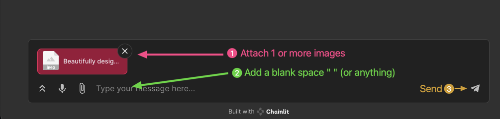
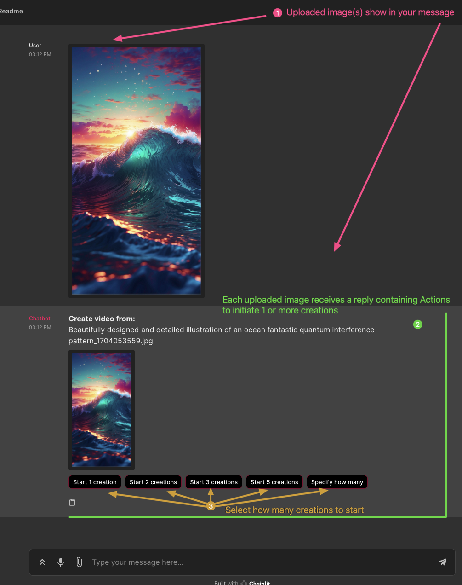
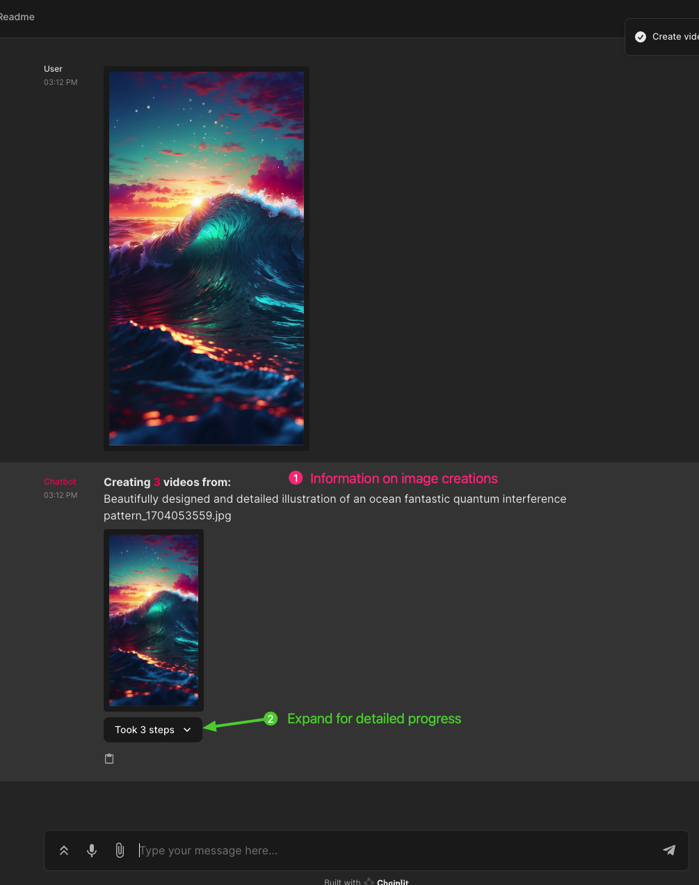
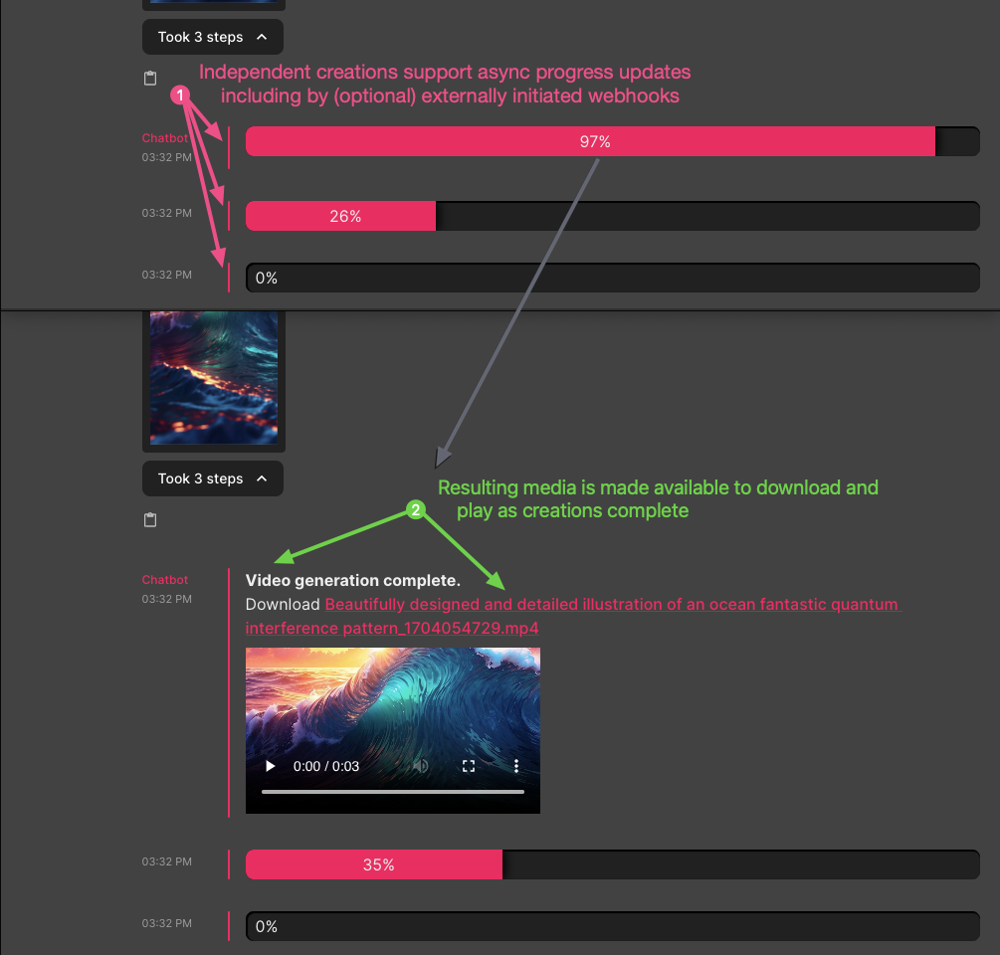
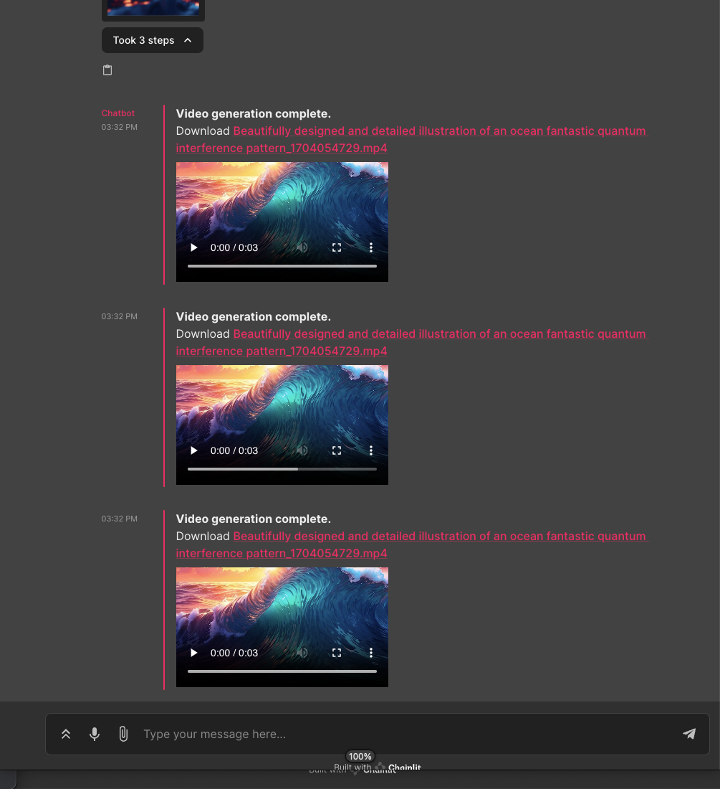

# 🛠️ Toolchain for Chainlit

**Description:**

🌟 The `Toolchain` is a suite of advanced tools designed for the `Chainlit` platform. It enhances the `Chainlit` context with the `SessionToolchain`, simplifying interactions from external sources such as webhooks for reporting the status of third-party services. The `ImageToolchain` aims to create abstract workflows for managing, modifying, and generating images. It efficiently handles multiple image generation jobs and variations without overwhelming the user with information.

---

## 🔑 Key Components

1. **ParsedReplicatePredictionLog**:
   - **Purpose:** 🎯 Crucial for monitoring and tracking the progress of various processes.
   - **Functionality:** 💡 Expertly parses and manages log data related to replicate predictions.

2. **SessionToolchain**:
   - **Role:** 🌐 Seamlessly manages the `chainlit` context across different connection states.
   - **Feature:** 🔗 Utilizes a public_id for webhook-based session restoration, ensuring consistent functionality in diverse scenarios.

3. **ImageToolchain**:
   - **Function:** 🖼️ Capably handles multiple image processing jobs and their variations.
   - **Integration:** 🤝 Collaborates with `SessionToolchain` for real-time external status updates and reporting.

---

### 📚 Usage

The toolchain is integrated with the `Chainlit` platform, providing sophisticated features for session management, image processing, and detailed logging. For in-depth usage, users are encouraged to refer to the specific functions and classes in each module.

---

#### Example `app.py` screenshots

***Step 01***

Send images to convert to videos.

- Attach 1 or more images to your message before sending.
- **Note**: You cannot send an empty message so type anything, ie. an empty space " " spacebar.

---

***Step 02***

Each image is copied to the server and displayed in your `Chainlit` reply.

- The chat bot responds with a separate `Message` for each image.
- A `Message` contains multiple `Action` components to help initiate `n` creations.
- The count `n` is defined with the presets in variable `batch_sizes`, currently [1, 2, 3, 5].
- An additional `Action` "Specify how many" prompts the user to enter an amount via `AskUserMessage`.

---

***Step 03***

Selecting an `Action` displays information about the creation progress.

- The `Message` changes its layout.
  - All `Action` components for creation are removed.
  - Information on the active creation process is displayed.
  - A `Step` is added for each `n` creation started, click for further progress details.

---

***Step 04***

Expand "Took `n` steps" for detailed progress reporting.

- The initial visibility can be changed with the `Expand Messages` user setting.
- Progress is tracked independly for each creation.
  - Progress updates are immediately reflected in the containing `Step` component.
  - As creations complete, a `Chainlit` `Video` component is automatically created to display the results.
- Updates to progress can be made asynchronously.
- External progressed updates can be initialized via webhooks.

---

***Step 05***

Enjoy *your* creations.

---

### Installation and Setup

*Detailed instructions for installation and setup will be provided, tailored to the project's deployment and dependency management requirements.*

---

### Contributions

*Guidelines for contributing to the project, including coding standards and the pull request process.*

---

### License

*Information about the project's licensing.*

---

*This README is a draft and can be adjusted to better fit the project's specifics and requirements.*

---
